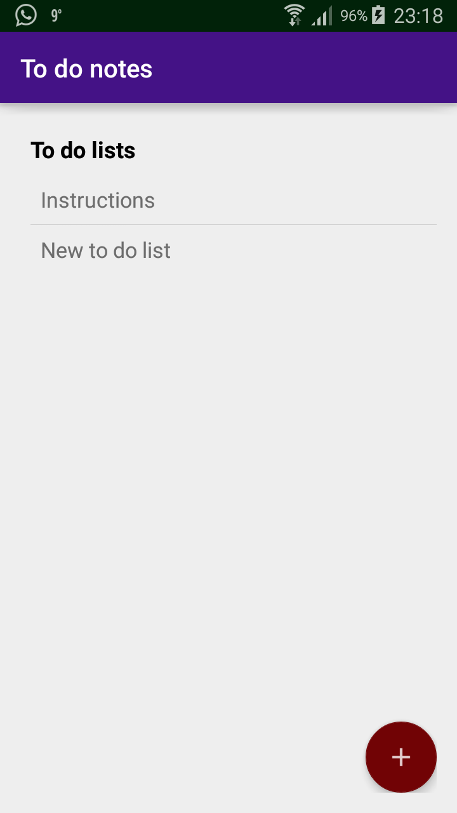
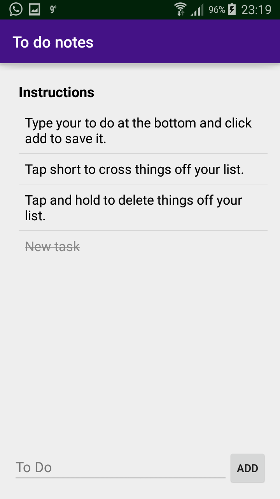

Nadeche Studer <nadeche.studer@gmail.com>

	To Do lists app.
	It shows a list of to do lists.
	The uses can add new lists.
	The user can delete lists by tapping and holding.
	By taping on a to do list it shows a list of to do items that are saved
	The user can add new tasks at the bottom.
	The user can also set tasks to done by tapping and delete them by tapping and holding.

